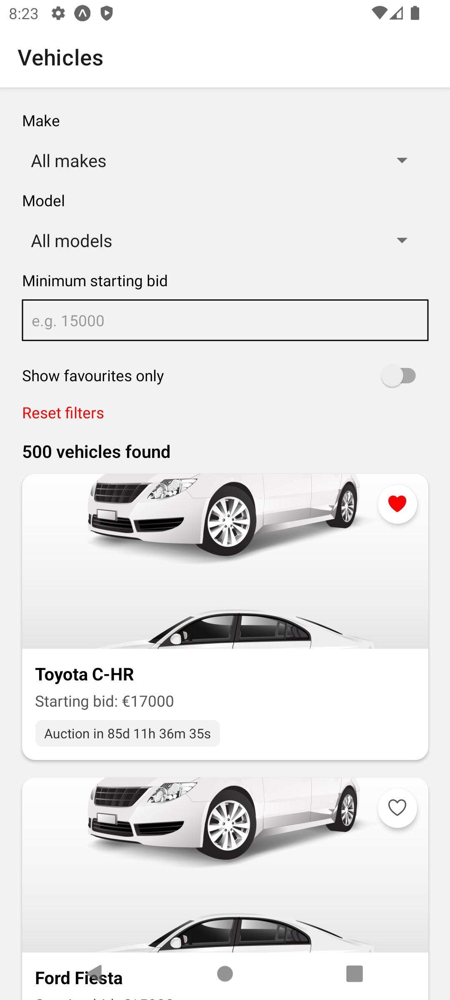
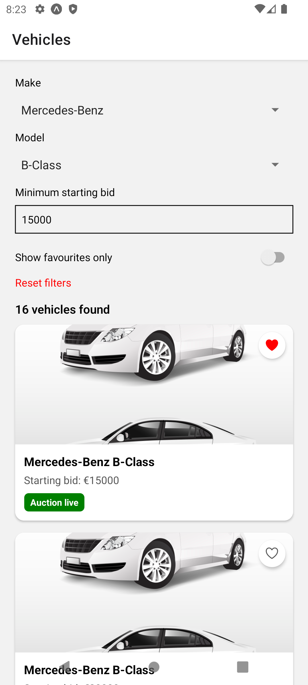
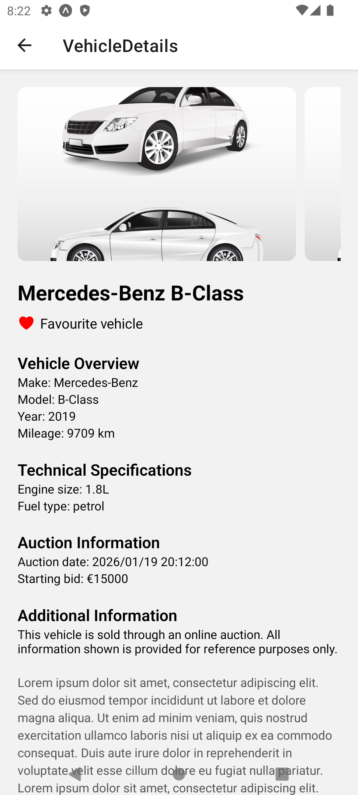

# Vehicle Results & Filtering – React Native App

This project is a **React Native vehicle listing application** built as part of a React Native Developer technical test. It demonstrates clean component design, local state management, filtering logic, navigation, and UI best practices without unnecessary complexity.

The goal of the app is to display a list of vehicles loaded from a static JSON file, allow users to filter and favourite vehicles, and view detailed information about each vehicle.

<p float="left">
  
  
  
</p>

---

## Features

### Vehicle Listing

- Loads vehicle data from a local JSON file
- Displays vehicles in a clean, card-based layout
- Each vehicle includes:
  - Make & model
  - Starting bid
  - Auction countdown (days / hours / minutes / seconds)
  - Favourite indicator
  - Image placeholder

### Advanced Filtering

- Filter by **Make** (dropdown)
- Filter by **Model** (dropdown)
- Make & Model filters are **bi-directional** (dependent on each other)
- Filter by **minimum starting bid**
- Toggle **Show favourites only**
- Reset all filters with a single action

### Favourites

- Vehicles can be marked as favourite / unfavourite
- Initial favourites are loaded from the dataset
- Favourite state is managed locally in React state
- Favourite status is shown in both list and details screens

### Vehicle Details Screen

- Navigate to a detailed vehicle page by tapping a card
- Displays:
  - Horizontal swipeable image gallery
  - Vehicle specifications
  - Favourite status
  - Placeholder descriptive text (lorem ipsum)

### Navigation

- Uses stack navigation to move between:
  - Vehicle list screen
  - Vehicle details screen

### Empty State & UX Polish

- Displays number of results found
- Friendly empty-state message when no vehicles match filters
- Clear visual feedback for auction states (countdown / live / ended)
- Consistent UI behavior across all interactions

---

## Tech Stack

- **React Native**
- **Expo (managed workflow)**
- **React Navigation**
- **JavaScript (ES6+)**

No Redux or global state libraries were used, as the scope and complexity of the app do not require them.

---

## Project Structure

```
src/
 ├─ components/
 │   ├─ VehicleCard.js
 │   └─ FilterBar.js
 │
 ├─ screens/
 │   ├─ VehicleListScreen.js
 │   └─ VehicleDetailScreen.js
 │
 ├─ data/
 │   └─ vehicles.json
 │
assets/
 └─ placeholderCar.jpg
```

---

## Running the Project

### Prerequisites

- Node.js (v20+ recommended)
- Expo CLI

### Install dependencies

```bash
npm install
```

### Start the app

```bash
npx expo start
```

The app can be run on:

- iOS Simulator
- Android Emulator
- Physical device using Expo Go

---

## Development & Testing Environment

- **Development machine:** macOS
- **Primary testing environment:** Android Studio Emulator
  - Android version: **Android 12**
- The application was tested to ensure consistent behavior across filtering, favourites, navigation, and countdown logic.

---

## Design & Architectural Decisions

### State Management

- The JSON file is treated as **static seed data**
- Runtime state (filters, favourites, UI state) is handled using React hooks
- No direct mutation of the JSON data occurs

### Favourites Handling

- Favourite state is initialized from the dataset
- Favourite changes are stored in component state
- This mirrors how a real application could later sync with a backend or persistent storage

### Filtering Strategy

- Filters are derived dynamically from the dataset
- Make and Model filters constrain each other symmetrically
- Invalid filter combinations are automatically prevented

### Performance Considerations

- A single shared timer is used for auction countdowns
- Countdown values are computed per item using a shared timer to minimize unnecessary timers and re-renders.
- `FlatList` is used to efficiently render large datasets

---

## Assumptions

- Vehicle data does not include unique IDs, so list indexes are used as keys
- Images are represented using a local placeholder due to lack of image URLs

---

## Requirements Checklist

- [x] Import vehicle data from JSON
- [x] Display vehicle results
- [x] Show auction countdown
- [x] Favourite / unfavourite vehicles
- [x] Filter by Make, Model, Starting Bid, Favourites
- [x] Vehicle details page
- [x] Image placeholders
- [x] Clean UX and empty states

---

**Author:** Diogo Teixeira
